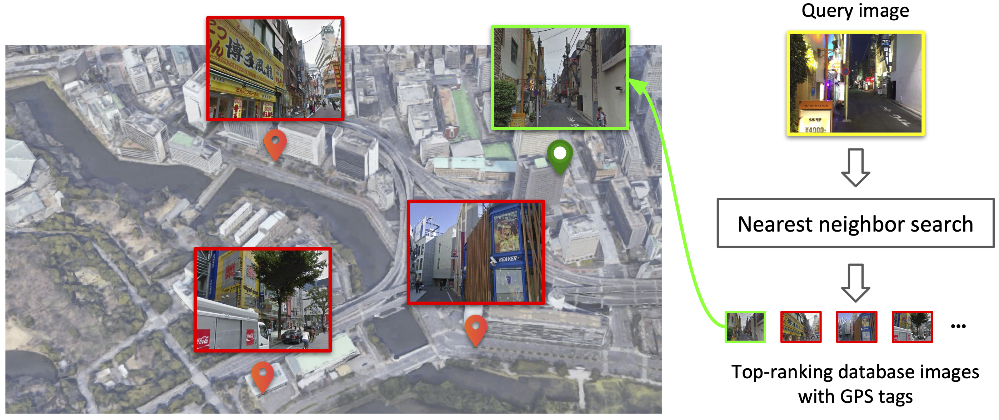

<!-- 
 -->

# OpenIBL

<p align="center">
    
</p>

## Introduction

`OpenIBL` is an open-source PyTorch-based codebase for image-based localization, or in other words, place recognition. It supports multiple state-of-the-art methods, and also covers the official implementation for our ECCV-2020 spotlight paper **SFRS**. We support **single/multi-node multi-gpu distributed** training and testing, launched by `slurm` or `pytorch`.

#### Official implementation:
+ [SFRS](docs/SFRS.md): Self-supervising Fine-grained Region Similarities for Large-scale Image Localization (ECCV'20 **Spotlight**) [[paper]](https://arxiv.org/abs/2006.03926) [[Blog(Chinese)]](https://zhuanlan.zhihu.com/p/169596514)

#### Unofficial implementation:
+ NetVLAD: CNN architecture for weakly supervised place recognition (CVPR'16) [[paper]](https://arxiv.org/abs/1511.07247) [[official code (MatConvNet)]](https://github.com/Relja/netvlad)
+ SARE: Stochastic Attraction-Repulsion Embedding for Large Scale Image Localization (ICCV'19) [[paper]](https://arxiv.org/abs/1808.08779) [[official code (MatConvNet)]](https://github.com/Liumouliu/deepIBL)

#### FAQ
+ **How to extract descriptor for a single image?**
Please refer to [Quick Start](#extract-descriptor-for-a-single-image).

+ **How to reproduce the results in the paper?**
Please first refer to [INSTALL.md](docs/INSTALL.md) for installation and dataset preparation, and then you can directly test our trained models (downloaded from [MODEL_ZOO.md](docs/MODEL_ZOO.md)) referring to [REPRODUCTION.md/Test](docs/REPRODUCTION.md#test), or you can train your own models referring to [REPRODUCTION.md/Train](docs/REPRODUCTION.md#train).

+ **How to add my custom dataset for training and testing?**
Please refer to [INSTALL.md/Use Custom Dataset](docs/INSTALL.md#use-custom-dataset-optional).


## Quick Start without Installation

### Extract descriptor for a single image
```shell
import torch
from torchvision import transforms
from PIL import Image

# load the best model with PCA (trained by our SFRS)
model = torch.hub.load('yxgeee/OpenIBL', 'vgg16_netvlad', pretrained=True).eval()

# read image
img = Image.open('image.jpg').convert('RGB') # modify the image path according to your need
transformer = transforms.Compose([transforms.Resize((480, 640)), # (height, width)
                                  transforms.ToTensor(),
                                  transforms.Normalize(mean=[0.48501960784313836, 0.4579568627450961, 0.4076039215686255],
                                                       std=[0.00392156862745098, 0.00392156862745098, 0.00392156862745098])])
img = transformer(img)

# use GPU (optional)
model = model.cuda()
img = img.cuda()

# extract descriptor (4096-dim)
with torch.no_grad():
    des = model(img.unsqueeze(0))[0]
des = des.cpu().numpy()
```

## Installation

Please refer to [INSTALL.md](docs/INSTALL.md) for installation and dataset preparation.

## Train & Test

To reproduce the results in papers, you could train and test the models following the instruction in [REPRODUCTION.md](docs/REPRODUCTION.md).

## Model Zoo

Please refer to [MODEL_ZOO.md](docs/MODEL_ZOO.md) for trained models.


## License

`OpenIBL` is released under the [MIT license](LICENSE).


## Citation

If you find this repo useful for your research, please consider citing the paper
```
@inproceedings{ge2020self,
    title={Self-supervising Fine-grained Region Similarities for Large-scale Image Localization},
    author={Yixiao Ge and Haibo Wang and Feng Zhu and Rui Zhao and Hongsheng Li},
    booktitle={European Conference on Computer Vision}
    year={2020},
}
```

## Acknowledgements

The structure of this repo is inspired by [open-reid](https://github.com/Cysu/open-reid), and part of the code is inspired by [pytorch-NetVlad](https://github.com/Nanne/pytorch-NetVlad).
