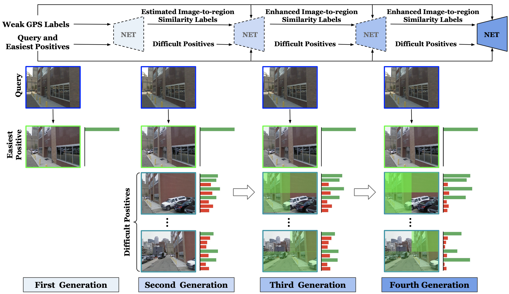

This repo covers the implementation for SFRS (as well as NetVLAD and SARE), which learns representations for image-based localization. Specifically, NetVLAD first proposed a VLAD layer trained with `triplet` loss, and then SARE introduced two softmax-based losses (`sare_ind` and `sare_joint`) to boost the training. Our SFRS is trained in generations with self-enhanced soft-label losses to achieve state-of-the-art performance. We support **single/multi-node multi-gpu distributed** training and testing, launched by `slurm` or `pytorch`.

#### Unofficial implementation:
+ NetVLAD: CNN architecture for weakly supervised place recognition (CVPR'16) [[paper](https://arxiv.org/abs/1511.07247)] [[official code (MatConvNet)](https://github.com/Relja/netvlad)]
+ SARE: Stochastic Attraction-Repulsion Embedding for Large Scale Image Localization (ICCV'19) [[paper](https://arxiv.org/abs/1808.08779)] [[official code (MatConvNet)](https://github.com/Liumouliu/deepIBL)]

#### Official implementation:
+ SFRS: Self-supervising Fine-grained Region Similarities for Large-scale Image Localization [[paper](https://arxiv.org/TODO)]

## Self-supervising Fine-grained Region Similarities

<div align=center></div>

## Installation

This repo was tested with Python 3.6, PyTorch 1.1.0, and CUDA 9.0. But it should be runnable with recent PyTorch versions >=1.0.0. (0.4.x may be also ok)
```shell
python setup.py install
```
**Note:** run the above setup command once changing the files in `ibl/` dictionary.

## Preparation

### Datasets

Currently, we support [Pittsburgh](https://www.cv-foundation.org/openaccess/content_cvpr_2013/papers/Torii_Visual_Place_Recognition_2013_CVPR_paper.pdf), [Tokyo 24/7](https://www.di.ens.fr/~josef/publications/Torii15.pdf) and [Tokyo Time Machine](https://arxiv.org/abs/1511.07247) datasets. The access of the above datasets can be found [here](https://www.di.ens.fr/willow/research/netvlad/).

**Note:** the results of all three methods (SFRS, NetVLAD, SARE) can be reproduced by training on Pitts30k-train and directly testing on the other datasets.

```shell
cd examples && mkdir data
```
Download the raw datasets and then unzip them under the directory like
```shell
examples/data
├── pitts
│   ├── raw
│   │   ├── pitts250k_test.mat
│   │   ├── pitts250k_train.mat
│   │   ├── pitts250k_val.mat
│   │   ├── pitts30k_test.mat
│   │   ├── pitts30k_train.mat
│   │   ├── pitts30k_val.mat
│   └── └── Pittsburgh/
└── tokyo
    ├── raw
    │   ├── tokyo247/
    │   ├── tokyo247.mat
    │   ├── tokyoTM/
    │   ├── tokyoTM_train.mat
    └── └── tokyoTM_val.mat
```

### Pre-trained Weights

```shell
mkdir logs && cd logs
```
After preparing the pre-trained weights, the file tree should be
```shell
logs
├── vd16_offtheshelf_conv5_3_max.pth # refer to (1)
└── vgg16_pitts_64_desc_cen.hdf5 # refer to (2)
```

**(1) imageNet-pretrained weights for VGG16 backbone from MatConvNet**

The official repos of NetVLAD and SARE are based on MatConvNet. To reproduce their results, we need to load the same pretrained weights. Directly download from [Google Drive](https://drive.google.com/file/d/1kYIbFjbb0RuNuD0cRIlKmOteFVI1jRzR/view?usp=sharing) and save it under the path of `logs/`.

**(2) initial cluster centers for VLAD layer**

**Note:** it is important as the VLAD layer cannot work with random initialization.

The original cluster centers provided by NetVLAD are highly **recommended**. You could directly download from [Google Drive](https://drive.google.com/file/d/1G5I48fVGOrOk8hPaNGni6q7fRcD_37gI/view?usp=sharing) and save it under the path of `logs/`.

Or you could compute the centers by running the script
```shell
./scripts/cluster.sh vgg16
```


## Train

All the training details (hyper-parameters, trained layers, backbones, etc.) strictly follow the original MatConvNet version of NetVLAD and SARE.

The default scripts adopt 4 GPUs (require ~11G per GPU) for training, where each GPU loads one tuple (anchor, positive(s), negatives).
+ In case you want to fasten training, enlarge `GPUS` for more GPUs, or enlarge the `--tuple-size` for more tuples on one GPU;
+ In case your GPU does not have enough memory (e.g. <11G), reduce `--pos-num` (only for SFRS) or `--neg-num` for fewer positives or negatives in one tuple.

#### PyTorch launcher: single-node multi-gpu distributed training

NetVLAD:
```shell
./scripts/train_baseline_dist.sh triplet
```

SARE:
```shell
./scripts/train_baseline_dist.sh sare_ind
# or
./scripts/train_baseline_dist.sh sare_joint
```

SFRS (state-of-the-art):
```shell
./scripts/train_sfrs_dist.sh
```

#### Slurm launcher: single/multi-node multi-gpu distributed training

Change `GPUS` and `GPUS_PER_NODE` accordingly in the scripts for your need.

NetVLAD:
```shell
./scripts/train_baseline_slurm.sh <PARTITION NAME> triplet
```

SARE:
```shell
./scripts/train_baseline_slurm.sh <PARTITION NAME> sare_ind
# or
./scripts/train_baseline_slurm.sh <PARTITION NAME> sare_joint
```

SFRS (state-of-the-art):
```shell
./scripts/train_sfrs_slurm.sh <PARTITION NAME>
```

## Test

During testing, the python scripts will automatically compute the PCA weights from Pitts30k-train or directly load from local files. Generally, `model_best.pth.tar` which is selected by validation in the training performs the best.

The default scripts adopt 8 GPUs (require ~11G per GPU) for testing.
+ In case you want to fasten testing, enlarge `GPUS` for more GPUs, or enlarge the `--test-batch-size` for larger batch size on one GPU, or add `--sync-gather` for faster gathering from multiple threads;
+ In case your GPU does not have enough memory (e.g. <11G), reduce `--test-batch-size` for smaller batch size on one GPU.

#### PyTorch launcher: single-node multi-gpu distributed testing

Pitts250k-test:
```shell
./scripts/test_dist.sh <PATH TO MODEL> pitts 250k
```

Pitts30k-test:
```shell
./scripts/test_dist.sh <PATH TO MODEL> pitts 30k
```

Tokyo 24/7:
```shell
./scripts/test_dist.sh <PATH TO MODEL> tokyo
```

#### Slurm launcher: single/multi-node multi-gpu distributed testing

Pitts250k-test:
```shell
./scripts/test_slurm.sh <PARTITION NAME> <PATH TO MODEL> pitts 250k
```

Pitts30k-test:
```shell
./scripts/test_slurm.sh <PARTITION NAME> <PATH TO MODEL> pitts 30k
```

Tokyo 24/7:
```shell
./scripts/test_slurm.sh <PARTITION NAME> <PATH TO MODEL> tokyo
```

## Trained models

**Note:** the models and results for NetVLAD and SARE here are trained by this repo, showing a slight difference from their original paper.

|   Model   |  Trained on  |   Tested on    |  Recall@1    |  Recall@5    |  Recall@10   | Download Link |
| :--------: | :---------: | :-----------: | :----------: | :----------: | :----------: | :----------: |
| SARE_ind | Pitts30k-train | Pitts250k-test | 88.4% | 95.0% | 96.5% | [Google Drive](https://drive.google.com/drive/folders/1ZNGdXVRwUJvGH0ZJdwy18A8e9H0wnFHc?usp=sharing) |
| SARE_ind | Pitts30k-train | Tokyo 24/7 | 81.0% | 88.6% | 90.2% | same as above |
| **SFRS** | Pitts30k-train | Pitts250k-test | 90.7% | 96.4% | 97.6% | [Google Drive](https://drive.google.com/drive/folders/1FLjxFhKRO-YJQ6FI-DcCMMHDL2K_Hsof?usp=sharing) |
| **SFRS** | Pitts30k-train | Tokyo 24/7 | 85.4% | 91.1% | 93.3% | same as above |


## Citation

If you find this repo useful for your research, please consider citing the paper
```
TODO
```

## Acknowledgements

The structure of this repo is inspired by [open-reid](https://github.com/Cysu/open-reid), and part of the code is inspired by [pytorch-NetVlad](https://github.com/Nanne/pytorch-NetVlad).
